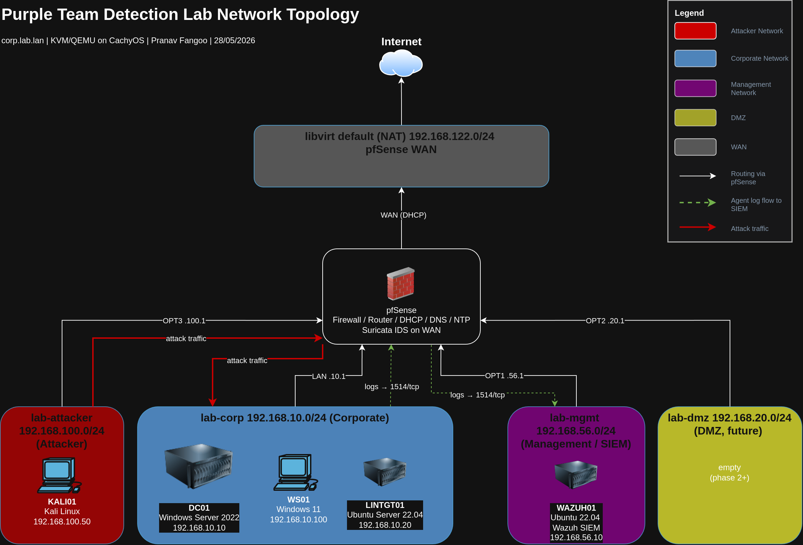

# Purple Team Detection Lab

A self-built purple team lab where I stand up an Active Directory environment,
attack it the way a real intruder would, and engineer the detections that catch
each attack. Built on KVM/QEMU on a single Linux workstation. Every detection is
written in Sigma, tested against real attack telemetry, and tuned to cut false
positives.

This project demonstrates detection engineering, SIEM operation, incident
response, and security automation, the skills that are growing as routine alert
triage gets automated away.

## Results at a glance

| Metric | Value |
|--------|-------|
| MITRE ATT&CK techniques exercised | - |
| Techniques detected by a custom rule | - |
| Custom Sigma rules written and tuned | - |
| Incident response reports | - |
| Mean time to detect (after tuning), Kerberoasting | - |
| Detections re-implemented in Microsoft Sentinel (KQL) | - |

## What this lab proves I can do

- Build and segment a network with a firewall (pfSense), enforce least privilege
  between zones, and route all egress through an IDS sensor (Suricata).
- Operate a SIEM end to end (Wazuh): enroll agents, ingest Windows and Linux
  telemetry, deploy Sysmon via Group Policy, and build dashboards.
- Run a full Active Directory attack chain by hand: AS-REP roasting,
  Kerberoasting, ACL abuse, DCSync, Golden Ticket.
- Write detection logic in Sigma, convert it to the SIEM's native format, deploy
  it, and tune out false positives.
- Automate the boring parts in Python: alert enrichment, coverage reporting, and
  a mini SOAR triage pipeline with an AI summarization stage.
- Re-implement the same detections as KQL in Microsoft Sentinel, demonstrating
  the on-prem-to-cloud transition that most enterprises are making.

## Architecture

<!-- 2 short paragraphs describing the design. Keep it tight. -->

The lab simulates a small company, `corp.lab.lan`, across four isolated network
segments: a corporate network, a management network for the security tooling, a
DMZ, and an external segment for the attacker. pfSense is the only device that
routes between them, which means every cross-zone packet and every outbound
connection is subject to firewall policy and IDS inspection.

Telemetry flows inward to a Wazuh SIEM on the management network. Attacks
originate from a Kali host on the external segment and must traverse pfSense to
reach the corporate network, generating realistic network-layer telemetry
alongside the host-layer telemetry from Sysmon and the Wazuh agents.

## A detection, start to finish

When the `sqlsvc` service account is Kerberoasted, the domain controller logs a
Kerberos service ticket request (Event ID 4769) with RC4 encryption, which is the
tell. The custom Sigma rule keys on that encryption downgrade combined with a
service account context. Full write-up:
[docs/06-incidents/INC-001-kerberoasting.md](docs/06-incidents/INC-001-kerberoasting.md).

## Repository structure

| Directory | Contents |
|-----------|----------|
| `docs/` | Architecture, build steps, detection engineering, incident reports |
| `diagrams/` | Network, attack chain, and detection pipeline diagrams |
| `sigma-rules/` | All custom detection rules |
| `scripts/` | Python automation (enrichment, coverage, mini SOAR) |
| `ansible/` | Infrastructure as code to rebuild the lab |
| `reports/` | The full engagement report (PDF) |
| `attack-navigator/` | MITRE ATT&CK coverage layer (JSON) |

## Full engagement report

The complete engagement report, written in the style of a real
penetration test deliverable, is at
[reports/purple-team-engagement-report.pdf](reports/purple-team-engagement-report.pdf).

## Walkthrough video

A walkthrough covering the architecture, a live attack, and the
detection firing: (in progress).

## Tech stack

<!-- shields.io badges. Generate at https://shields.io. Example below. -->

## About

Built by Pranav Fangoo, https://ca.linkedin.com/in/pranav-fangoo. 

--- 
> *“Hard work beats talent when talent doesn't work hard.”* - **Tim Notke**